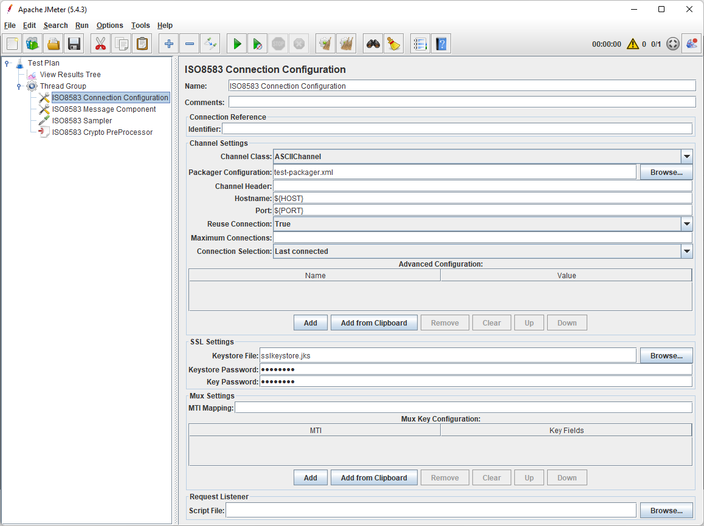
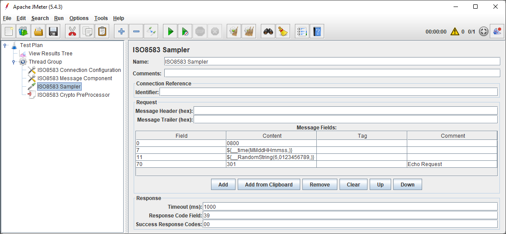
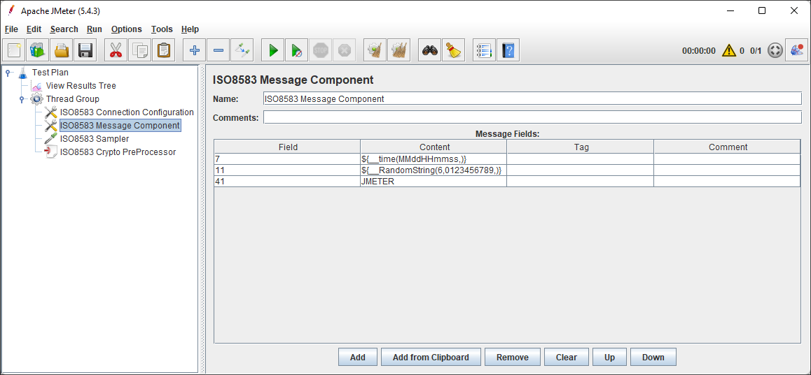
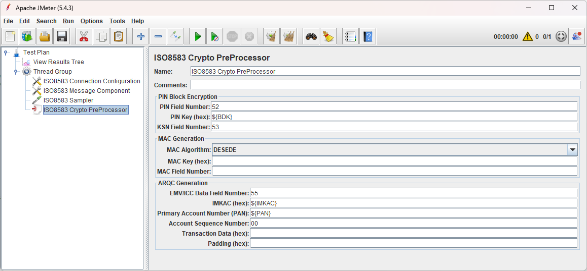

# jmeter-iso8583 [![travis][travis-image]][travis-url]

[travis-image]: https://travis-ci.com/tilln/jmeter-iso8583.svg?branch=master
[travis-url]: https://travis-ci.com/tilln/jmeter-iso8583

Overview
--------

Apache JMeter plugin for load testing of payment gateways and switches via [ISO 8583](https://en.wikipedia.org/wiki/ISO_8583) messaging, 
based on the excellent [jPOS framework](http://jpos.org/). Includes the following components:

- [*ISO8583 Sampler*](#sampler) for defining and sending messages,
- [*ISO8583 Connection Configuration*](#config) for integration with the system under test,
- [*ISO8583 Message Component*](#component) (optional) for sharing common message fields,
- [*ISO8583 Crypto PreProcessor*](#crypto) (optional) for encryption operations of certain message elements (PIN Block, MAC, ARQC).
- [*Crypto functions*](#functions) (optional) for non-message related cryptographic calculations.

#### Prerequisites
A so-called Packager is required to transform ("pack") the message into its binary representation for sending it over the wire.
This plugin uses a jPOS [Generic Packager](http://jpos.org/doc/proguide.pdf#%5B%7B%22num%22%3A1736%2C%22gen%22%3A0%7D%2C%7B%22name%22%3A%22XYZ%22%7D%2C54%2C133.877%2Cnull%5D)
that needs to be configured with an XML file.

Often one of the jPOS [packager configuration files](https://github.com/jpos/jPOS/tree/master/jpos/src/dist/cfg/packager)
may be used as-is or with few customisations.

#### Sample Message


In JMeter's *View Results Tree* and JTL files, request and response messages are represented 
as XML, so Extractors and Assertions can easily be used.
A hex dump of the raw (binary) message is included for troubleshooting purposes.


Usage
-----

<h3 id="config">ISO8583 Connection Configuration</h3>



This Configuration Element represents a connection to the system under test.
It must be present in the [Scope](https://jmeter.apache.org/usermanual/test_plan.html#scoping_rules)
of an *ISO8583 Sampler*.

Mandatory settings:
- *Channel Class*: 
Encapsulates the wire protocol details. The dropdown contains classes included in jPOS 
(refer [Channels documentation](http://jpos.org/doc/javadoc/org/jpos/iso/channel/package-summary.html)). 
If none of those are suitable, a custom channel class may be supplied (enter fully qualified class name).
- *Packager Configuration*:
XML configuration file that defines the packaging format of each message field (as per Prerequisites above).
- *Hostname*: 
    * Client mode (JMeter connects to switch socket): Name or IP address of the switch to connect to.
    * Server mode (switch connects to JMeter socket): Leave blank. JMeter will wait for incoming connection from the switch
      before starting threads (timeout configurable via JMeter property `jmeter.iso8583.incomingConnectionTimeout`).
- *Port*: 
Port number to connect to (outgoing from JMeter in client mode; incoming to JMeter in server mode).
- *Reuse Connection* (only for client mode; since v1.1): Whether to reuse a persistent connection or reconnect for every request
(default: true).
- *Maximum Connections* (since v1.1):
    * Client mode (only for non-persistent connections): Maximum number of concurrent connections to the remote host.
    * Server mode: Ignored.

Optional settings:
- *Connection Reference*: This *Identifier* can be used to distinguish multiple configuration elements in a sampler's Scope.
- *Channel Header*: 
A static header string for all messages (sent and received). 
Note that some Channels use dynamic headers instead (e.g. VAPChannel).
- *Advanced Configuration*: 
Channel-dependent properties can be specified via *Name*/*Value* pairs.
For example, [`srcid` and `dstid`](https://github.com/jpos/jPOS/blob/v2_1_6/jpos/src/main/java/org/jpos/iso/channel/VAPChannel.java#L236-L237)
for VAPChannel's [Base1Header](https://github.com/jpos/jPOS/blob/v2_1_6/jpos/src/main/java/org/jpos/iso/header/BASE1Header.java).
- *SSL Settings*: 
For SSL/TLS connections, the *Keystore File* 
(protected with *Keystore Password* for the file and *Key Password* for a private key) should contain:
    * Client mode: the server's public certificate to trust and, optionally, 
      the client certificate to send for authentication (mutual SSL).
    * Server mode: the server certificate (with public and private key).
- *Mux Settings* (since v1.1):
    Control how the Mux finds matches between outgoing requests and incoming response messages. 
    See [QMUX documentation](https://github.com/jpos/jPOS/blob/v2_1_6/doc/src/asciidoc/ch08/qmux.adoc#mti-mapping-and-default-key)
    for further details.
    * *MTI Mapping*: 3 ten-digit numbers representing how the first 3 MTI digits are mapped between request and response.
    Example (default): "0123456789 0123456789 0022446789" maps response MTI `0110` to request MTI `0100`.
    * *Mux Key Configuration*:
        Each row contains the key fields for a message type as per the *MTI* column, or for all
        messages if the *MTI* column is empty.
        
        Example: Override default key to use fields 42, 41, 11 for all messages, 
        except *0800* messages for which field 41 is used.

        |MTI |Key Fields|
        |----|----------|
        |    |42 41 11  |
        |0800|41        |
- *Connection Selection* (since v1.2):
    * Client mode: Ignored.
    * Server mode: If there are multiple inbound socket connections (from the system under test to JMeter),
     this determines which of these connections to select when sending a request.
     "Last connected" (default) sends to the most recently connected socket.
     "Round robin" cycles through the connections one after the other.
     "All connected" sends to all of them.
- *Request Listener* (since v1.2):
    A *BSH Script File* (BeanShell) can be specified that will be interpreted at run time for every **incoming** request.
    It can be used to respond to network management (0800) messages from the system under test, such as sign-on, key exchange etc.

    Example (refer jPOS documentation of the similar [BSH Filter](https://github.com/jpos/jPOS/blob/v2_1_6/doc/src/asciidoc/ch05/channel_filters.adoc#bshfilter) for more details):

    ```groovy
    if ("0800".equals(message.getMTI())) {
        message.setResponseMTI();
        message.set(39, "00");
        if ("101".equals(message.getString(70))) { // key change message
            // store message details in JMeter property:
            org.apache.jmeter.util.JMeterUtils.getJMeterProperties().put("KEY", message.getString(48));
        }
        source.send(message);
    }
    ```

##### Implementation Details

This component encapsulates a jPOS [Q2 container](http://jpos.org/doc/proguide.pdf#%5B%7B%22num%22%3A2464%2C%22gen%22%3A0%7D%2C%7B%22name%22%3A%22XYZ%22%7D%2C54%2C769.889%2Cnull%5D)
and [QBeans services](http://jpos.org/doc/proguide.pdf#%5B%7B%22num%22%3A3393%2C%22gen%22%3A0%7D%2C%7B%22name%22%3A%22XYZ%22%7D%2C54%2C769.889%2Cnull%5D).
It manages either set of 3 components (depending on client or server mode):
- ChannelAdaptor, Channel and QMUX
- QServer, Channel and QMUX

While normally those would be configured by placing corresponding XML files into a `deploy` folder,
here it is done dynamically via transforming configuration properties from the JMeter Test Plan
into in-memory deployment descriptor objects.
These descriptors are then used to create and deploy QBeans at the test start and destroy them at the end.

For even more advanced use cases, above XML files may still be used and copied to the Q2 deploy folder.
Its location is configurable via JMeter property `jmeter.iso8583.q2DeployDir`.


<h3 id="sampler">ISO8583 Sampler</h3>

The sampler needs an [*ISO8583 Connection Configuration*](#config) in its Scope.
If there are multiple configuration elements, the optional *Connection Reference*/*Identifier*
can be used to associate the sampler to a specific one (since v1.2).



Each row of the *Message Fields* table represents one data element of the message. The columns have the following meaning:
- *Field*: Field number (decimal), with 0 being the Message Type Indicator (MTI).
- *Content*: A string representation of the field's data content. This may be a text, numeric, or binary value. 
Note that the Packager configuration determines how this is interpreted.
For example, a binary field will expect a string of hexadecimal digits (without `0x` prefix).
A text field's character encoding depends on the Packager configuration too (e.g. ASCII, EBCDIC).
- *Tag* (hexadecimal): Used for tagged fields (e.g. ICC/EMV data fields), otherwise empty.
- *Comment*: For documentation purposes.

Note that Bitmaps will be generated automatically.

Optional message header and trailers may be specified as hex digits.

#### Binary Field Content

If the field's `class` attribute in the Packager configuration file is a subclass of 
[`ISOBinaryFieldPackager`](http://jpos.org/doc/javadoc/org/jpos/iso/ISOBinaryFieldPackager.html)
the field's *Content* is treated as binary and interpreted as hex digits (replacing incorrect digits with `F`).

If the Packager's field class is not binary or cannot be determined (e.g. if there are no subfields, as for
[`BERTLVBinaryPackager`](http://jpos.org/doc/javadoc/org/jpos/tlv/packager/bertlv/BERTLVBinaryPackager.html),
the *Content* will be taken as-is and not be interpreted as hex digits.
JMeter's function [`${__char()}`](https://jmeter.apache.org/usermanual/functions.html#__char)
can be used to enter binary values in that case.

For tagged fields, the tag value is also used to distinguish binary fields.
This works for well-known, standard EMV tags, but needs to be configured for proprietary tags.
The JMeter property `jmeter.iso8583.binaryFieldTags` can be used to define a comma-separated list of 
hexadecimal tag numbers. Note this will cause all fields with one of those tags to be interpreted as binary.


#### Response Validation

The response code can be used to distinguish failed and successful samples 
(similar to JMeter's [HTTP Request](https://jmeter.apache.org/usermanual/component_reference.html#HTTP_Request)
marking 4xx and 5xx responses as failures).
- *Timeout (ms)*: A response timeout in milliseconds can be defined individually for each sampler.
  The value 0 can be used to send requests without expecting any response message 
  (["fire and forget"](https://www.enterpriseintegrationpatterns.com/patterns/conversation/FireAndForget.html);
  since v1.1).
- *Response Code Field* (usually 39): Field number that is used to determine a sample success or failure.
- *Success Response Codes* (usually 00): Expected value for successful responses. 
  This can be a comma-delimited list of valid values (since v1.1).

If either of the Response Code entries are empty, no validation will be performed.

#### Subfields

For example, field 43 "Card Acceptor Location" contains 3 subfields that can be defined as follows:

|Field|Content|Tag|Comment|
|-----|-------|---|-------|
|43.1 |JMeter |   |Name   |
|43.2 |Nowhere|   |City   |
|43.3 |NZ     |   |Country|

This has to be matched by a packager configuration like the below:

```xml
    <isofieldpackager id="43"
            name="CARD ACCEPTOR LOCATION"
            length="40"
            class="org.jpos.iso.IFB_BINARY"
            packager="org.jpos.iso.packager.GenericSubFieldPackager"
            emitBitmap="false"
            firstField="1"
            maxValidField="3">
        <isofield id="1" name="NAME"    length="25" pad="false" class="org.jpos.iso.IF_CHAR"/>
        <isofield id="2" name="CITY"    length="13" pad="false" class="org.jpos.iso.IF_CHAR"/>
        <isofield id="3" name="COUNTRY" length="2"  pad="false" class="org.jpos.iso.IF_CHAR"/>
    </isofieldpackager>	
```

#### Tagged Fields

For example, field 55 with ICC/[EMV](https://en.wikipedia.org/wiki/EMV) data 
in [BER-TLV](https://en.wikipedia.org/wiki/Basic_Encoding_Rules) format can be defined as in the following example:

|Field|Content|Tag|Comment|
|-----|-------|---|-------|
|55.1|000000000199|9F02|Amount, Authorised|
|55.2|000000000000|9F03|Amount, Other|
|55.3|0554|9F1A|Terminal Country Code|
|55.4|0000000000|95|Terminal Verification Results|
|55.5|0554|5F2A|Transaction Currency Code|
|55.6|<code>${__time(yyMMdd,)}</code>|9A|Transaction Date|
|55.7|01|9C|Transaction Type|
|55.8|<code>${__RandomString(8,0123456789ABCDEF,)}</code>|9F37|Unpredictable Number|
|55.9|5C00|82|Application Interchange Profile|
|55.10|<code>${ATC}</code>|9F36|Application Transaction Counter|
|55.11|<code>${IAD}</code>|9F10|Issuer Application Data|

Provided a matching packager configuration like this:

```xml
      <isofieldpackager
          id="55"
          length="255"
          name="Integrated Circuit Card Related Data"
          class="org.jpos.iso.IFB_LLLHBINARY"
          packager="org.jpos.tlv.packager.bertlv.BERTLVBinaryPackager"
          emitBitmap="false"/>
```


<h3 id="component">ISO8583 Message Component</h3>



This (optional) Configuration element may be used to define fields in the same way as for the *ISO8583 Sampler*.
However, its fields will be applied to all samplers in scope, so it can be used for common data elements like dates and times.

|Field|Content|Tag|Comment|
|-----|-------|---|-------|
|7|<code>${__time(MMddHHmmss,)}</code>| |Transmission date & time|
|12|<code>${__time(HHmmss,)}</code>| |Local transaction time|
|13|<code>${__time(MMdd,)}</code>| |Local transaction date|
|15|<code>${__time(MMdd,)}</code>| |Settlement date|
|16|<code>${__time(MMdd,)}</code>| |Currency conversion date|
|17|<code>${__time(MMdd,)}</code>| |Capture date|

If any particular field number is present in the sampler as well as the Component, the one in the sampler takes precedence.

If a sampler has more than one Component in its scope, their fields will all be merged into the sampler, 
unless a field is already present in the sampler *or* a Component in a scope closer to the sampler.

In other words, inner fields take precedence over outer ones, 
with the sampler's fields themselves being the innermost ones.


<h3 id="crypto">ISO8583 Crypto PreProcessor</h3>



This (optional) Preprocessor modifies a message, based on cryptographic calculations, 
before it is packaged and sent by the sampler.

This is necessary for some fields that can only be determined during runtime of the JMeter test,
rather than being generated before the test, as they may depend on dynamic session keys or other, dynamic message fields.

Currently supported are the following operations:
- *PIN Block Encryption*: Encrypts a clear PIN Block given a zone PIN key (ZPK) or base derivation key (BDK).
- *MAC Generation*: Calculates the MAC (Message Authentication Code), given a session MAC key.
- *ARQC Generation*: Calculates the Authorization Request Cryptogram (ARQC), given the ICC Master Key (IMKAC).

All keys need to be provided as clear (unencrypted) hex digits.

Any subset of these operations may be performed by leaving some or all of the other ones' inputs blank.
For example, if no key is present for one of the operations, it will be skipped.

As the MAC depends on the entire message content, its calculation is the last to be done.

#### PIN Block Encryption

- *PIN Field Number* (usually 52): A clear PIN Block in this field will be replaced with the encrypted one.
- *PIN Key (hex)*: Clear DES key to use as ZPK for zone PIN encryption (16, 32 or 48 hex digits), 
or Triple-DES key to use as BDK for DUKPT (32 hex digits).
- *KSN Field Number* (usually 53): Empty for zone PIN encryption. Otherwise, for DUKPT encryption, 
the 16 hex digits in this field will be interpreted as the Key Serial Number (KSN).

The KSN scheme can be configured by changing the JMeter property `jmeter.iso8583.ksnDescriptor`. 
For example, its default "6-5-5" means `bbbbbbdddddccccc` will be partitioned into 
BDK ID `bbbbbb`, device ID `ddddd`, and transaction counter `ccccc`.

#### MAC Generation

- *MAC Algorithm*: Cipher algorithm name for EDE or CBC MAC calculation 
(refer [BouncyCastle specification](https://www.bouncycastle.org/specifications.html))
- *MAC Key (hex)*: Clear Triple-DES key (32 or 48 hex digits), usually from a key exchange.
- *MAC Field Number*: Can be used to force the MAC in a specific field. If left blank,  
the MAC field will be the next multiple of 64 from the last field in the message (e.g. 64, 128, 192).

#### ARQC Generation

- *EMV/ICC Data Field Number* (usually 55): The ARQC input fields will be taken from **subfields** of this field
(unless *Transaction Data* is specified below),
and the calculated ARQC value will be added as an additional subfield (tag `9F26`).
- *IMKAC (hex)*: Clear ICC Master Key for Application Cryptogram calculation.
- *Session Key Derivation Method*: How to derive the UDK from the Master Key.
- *Primary Account Number (PAN)*: Input parameter for session key derivation.
- *Account Sequence Number*: Input parameter for session key derivation (2 digits).
- *Transaction Data (hex)*: Input data for ARQC calculation (as byte sequence). 
    If left blank, relevant fields will be automatically extracted from the ICC Data field.

    Which ICC subfields are to be included in the ARQC calculation can be configured (globally) by specifying the tags
    in the JMeter property `jmeter.iso8583.arqcInputTags` (default: `9F02,9F03,9F1A,95,5F2A,9A,9C,9F37,82,9F36,9F10`).
    Missing ARQC input tags will be ignored, i.e. no validation is performed that all mandatory tags are present.

    The JMeter property `jmeter.iso8583.arqcFromFullIADForCVNs` (default: `12,16`; since v1.2)
    determines for which CVNs the entire Issuer Application Data (tag `9F10`)
    is to be included in the ARQC calculation instead of the CVR portion only.

    **Note:** Changed behaviour! For v1.0 the data in this field is *appended* to the automatically extracted fields,
    whereas as of v1.1 data in this field overrides the extraction.
- *Padding (hex)* (since v1.1): Padding bytes to append to transaction data before ARQC calculation 
(leave blank for zero-padding, 80 for ISO9797-1 Method 2).

<h3 id="functions">Crypto Functions (since v1.1)</h3>

#### __calculateCVV

Example: `${__calculateCVV(${CVK}, ${PAN}, ${EXP}, 999, iCVV)}`

Arguments:
1. Combined CVV Keys (hex digits)
2. Primary Account Number (PAN)
3. Expiry date (yyMM)
4. Service Code (3 digits)
5. Name of variable in which to store the result (optional)

#### __calculateDESKeyCheckValue

Example: `${__calculateDESKeyCheckValue(${ZPK}, KCV)}`

Arguments:
1. Clear DES key for which to calculate the key check value (hex digits)
2. Name of variable in which to store the result (optional)

#### __calculatePINBlock

Example: `${__calculatePINBlock(1234, 34, ${PAN}, PINBLOCK)}`

Arguments:
1. PIN
2. PIN Block Format (as per [jPOS API docs](http://jpos.org/doc/javadoc/org/jpos/security/SMAdapter.html#field.summary)):
 
    |Format|Description|
    |--|-|
    | 1|adopted by ANSI (ANSI X9.8) and is one of two formats supported by the ISO (ISO 95641 - format 0).|
    | 2|supports Douctel ATMs.|
    | 3|Diebold Pin Block format.|
    | 4|PIN block format adopted by the PLUS network.|
    | 5|ISO 9564-1 Format 1 PIN Block.|
    |34|standard EMV PIN block format.|
    |35|required by Europay/MasterCard for their Pay Now & Pay Later products.|
    |41|Visa format for PIN change without using the current PIN.|
    |42|Visa format for PIN change using the current (old) PIN.

3. Primary Account Number (PAN)
4. Name of variable in which to store the result (optional)

#### __encryptDESKey

Example: `${__encryptDESKey(${ZPK}, ${KEK}, ZPK_under_KEK)}`

Arguments:
1. Clear DES key to be encrypted (hex digits)
2. DES key for encrypting the clear key (hex digits)
3. Name of variable in which to store the encrypted key (optional)

#### __generateDESKey

Example: `${__generateDESKey(192, ZPK)}`

Arguments:
1. Key length in bits (64, 128 or 192)
2. Name of variable in which to store the result (optional)


Installation
------------
### Via [PluginsManager](https://jmeter-plugins.org/wiki/PluginsManager/)

Under tab "Available Plugins", select "ISO8583 Sampler", then click "Apply Changes and Restart JMeter".

### Via Package from [JMeter-Plugins.org](https://jmeter-plugins.org/)

Extract the [zip package](https://jmeter-plugins.org/files/packages/tilln-iso8583-1.2.zip) into JMeter's root directory, then restart JMeter.

### Via Manual Download

1. Copy the [jmeter-iso8583 jar file](https://github.com/tilln/jmeter-iso8583/releases/download/1.2/jmeter-iso8583-1.2.jar) into JMeter's `lib/ext` directory.
2. Copy the following dependencies into JMeter's `lib` directory (and optionally remove older versions of any of those jar files):
    * [org.jpos / jpos](https://search.maven.org/remotecontent?filepath=org/jpos/jpos/2.1.6/jpos-2.1.6.jar)
    * [org.bouncycastle / bcprov-jdk15on](https://search.maven.org/remotecontent?filepath=org/bouncycastle/bcprov-jdk15on/1.67/bcprov-jdk15on-1.67.jar)
    * [org.bouncycastle / bcpg-jdk15on](https://search.maven.org/remotecontent?filepath=org/bouncycastle/bcpg-jdk15on/1.67/bcpg-jdk15on-1.67.jar)
    * [org.jdom / jdom2](https://search.maven.org/remotecontent?filepath=org/jdom/jdom2/2.0.6/jdom2-2.0.6.jar)
    * [org.osgi / org.osgi.core](https://search.maven.org/remotecontent?filepath=org/osgi/org.osgi.core/6.0.0/org.osgi.core-6.0.0.jar)
    * [commons-cli / commons-cli](https://search.maven.org/remotecontent?filepath=commons-cli/commons-cli/1.4/commons-cli-1.4.jar)
    * [org.yaml / snakeyaml](https://search.maven.org/remotecontent?filepath=org/yaml/snakeyaml/1.26/snakeyaml-1.26.jar)
    * [org.hdrhistogram / HdrHistogram](https://search.maven.org/remotecontent?filepath=org/hdrhistogram/HdrHistogram/2.1.12/HdrHistogram-2.1.12.jar)
    * [org.javatuples / javatuples](https://search.maven.org/remotecontent?filepath=org/javatuples/javatuples/1.2/javatuples-1.2.jar)
3. Restart JMeter.


Configuration
-------------

### JMeter Properties

The following properties control the plugin behaviour:

- `jmeter.iso8583.q2DeployDir`: 
   Directory where Q2 looks for deployment files. Will be created if not there yet.
   (default: `deploy` subfolder from where JMeter was started).
- `jmeter.iso8583.q2StartupTimeout` (ms): 
   How long to wait until the Q2 component starts up (default: 2 seconds).
- `jmeter.iso8583.q2PackagerLogging` (true/false; since v1.1):
   Whether to include Packager log information to the JMeter log output. 
   This may be useful in DEBUG mode to troubleshoot Packager issues. (default: false). 
- `jmeter.iso8583.incomingConnectionTimeout` (ms): 
   How long to wait for incoming connections when running in server-mode (default: 1 minute).
- `jmeter.iso8583.channelReconnectDelay` (ms): 
   May be used to override the Q2 Channel Adaptor default of 10 seconds.
- `jmeter.iso8583.arqcInputTags`:
   Comma-separated list of hexadecimal EMV tag numbers that will be included in the ARQC calculation.
   This may be used to include additional (or exclude standard) tags
   (default: `9F02,9F03,9F1A,95,5F2A,9A,9C,9F37,82,9F36,9F10`).
- `jmeter.iso8583.arqcFromFullIADForCVNs` (since v1.2):
   Comma-separated list of hexadecimal CVNs (Cryptogram Version Numbers) for which the ARQC calculation
   includes the full content of tag `9F10` (Issuer Application Data)
   instead of just the CVR (Card Verification Results) portion
   (default: `12,16` = CVN18, CVN22).
- `jmeter.iso8583.binaryFieldTags`:
   Comma-separated list of hexadecimal tag numbers that will be interpreted as binary fields,
   in addition to binary EMV tags (default: none).
- `jmeter.iso8583.ksnDescriptor`:
   Defines the [Key Serial Number Scheme](https://en.wikipedia.org/wiki/Derived_unique_key_per_transaction#Practical_Matters_(KSN_scheme)),
   i.e. the length (in hex digits) of the KSN parts: BDK ID (or KSI), Device ID (or TRSM ID), transaction counter
   (default: "6-5-5").

Limitations
-----------

- Minimum JMeter version 4.0

Troubleshooting
---------------
Inspect the JMeter log, after increasing the log level to DEBUG, e.g. `jmeter -Lnz.co.breakpoint.jmeter.iso8583=DEBUG`.
